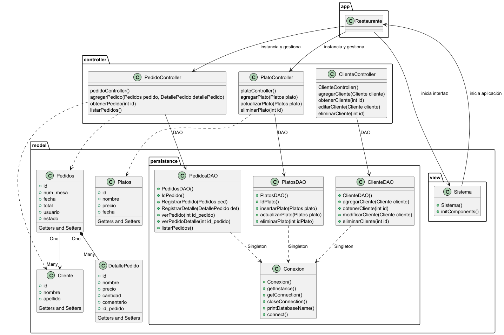

# ☕ Restaurante Java

Este proyecto es una **aplicación de gestión de restaurantes** desarrollada en **Java** ☕, como parte de un trabajo práctico para la Universidad Siglo 21 en Argentina. La aplicación permite manejar la administración de pedidos y platos en un entorno de restaurante, gestionando detalles de pedidos, mesas, clientes, y platos a través de una interfaz gráfica.

## Características del Proyecto

- **Gestión de Pedidos y Platos**: Control de pedidos y platos mediante controladores específicos (`PedidoController` y `PlatoController`), permitiendo agregar, actualizar y eliminar entradas.
- **Persistencia de Datos**: Implementación de un sistema DAO (Data Access Object) utilizando **JDBC** y **SQLite** como base de datos. Las clases `ClienteDAO`, `PedidosDAO`, y `PlatosDAO` se encargan de la gestión de datos para cada entidad.
- **Arquitectura MVC**: El sistema sigue el patrón **Modelo-Vista-Controlador (MVC)**, donde:
  - El paquete `model` contiene las clases de entidades (como `Cliente`, `Pedidos`, `Platos`, y `DetallePedido`).
  - El paquete `controller` incluye los controladores que gestionan la lógica de negocio y manipulan los datos.
  - El paquete `view` contiene las interfaces gráficas para interactuar con el sistema, a través de la clase `Sistema`.
- **Conexión a Base de Datos**: Uso de la clase `Conexion` para gestionar la conexión con la base de datos MySQL.

## 📂 Estructura del Proyecto
```plaintext
app
 └── Restaurante.java               # Clase main del sistema
controller
 ├── PedidoController.java          # Controlador para pedidos
 └── PlatoController.java           # Controlador para platos
model
 ├── Cliente.java                   # Clase de entidad Cliente
 ├── DetallePedido.java             # Clase de detalle de pedido
 ├── Pedidos.java                   # Clase de entidad Pedidos
 ├── Platos.java                    # Clase de entidad Platos
 └── persistence
     ├── ClienteDAO.java            # DAO para Cliente
     ├── PedidosDAO.java            # DAO para Pedidos
     ├── PlatosDAO.java             # DAO para Platos
     └── Conexion.java              # Gestión de la conexión a la base de datos
view
 └── Sistema.java                   # Interfaz gráfica para interacción con el sistema
```

## Diagrama UML

